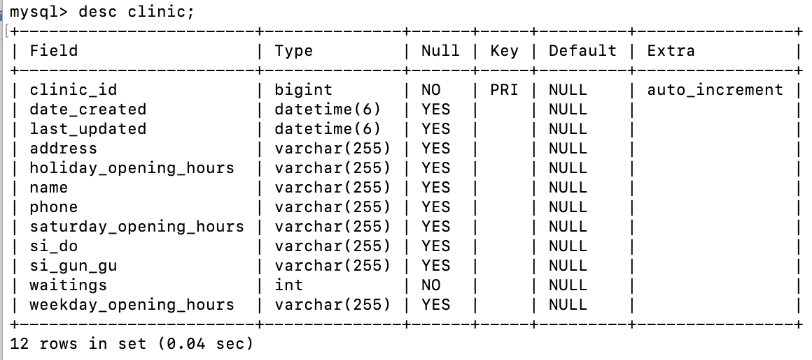
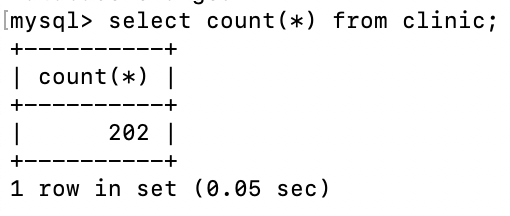

## 임시선별검사소 데이터 
보건복지부의 전국 코로나19 임시선별검사소 202개 데이터 활용(9월 26일 기준)    
출처 : https://www.mohw.go.kr/react/popup_200128_7.html

## 주요 라이브러리
pandas 1.3.3 - Python Data Analysis Library   
PyMySQL 1.0.2 - Pure Python MySQL Client   

## 코드 설명
- AWS RDS (MySQL)과 연결
~~~python
conn = pymysql.connect(
    host={RDS host},
    user={user},
    password={password},
    db={db이름},
    charset='utf8'
)
~~~
→ { }안에 RDS 관련 설정 값으로 채우기

- SQL문을 통해 DB Table의 데이터 값으로 INSERT
~~~python
sql = "insert into clinic (address, holiday_opening_hours, name, phone, saturday_opening_hours, si_do, si_gun_gu, waitings, weekday_opening_hours) values (%s, %s, %s, %s, %s, %s, %s, %s, %s)"
~~~

- 테이블 구조
   
  
